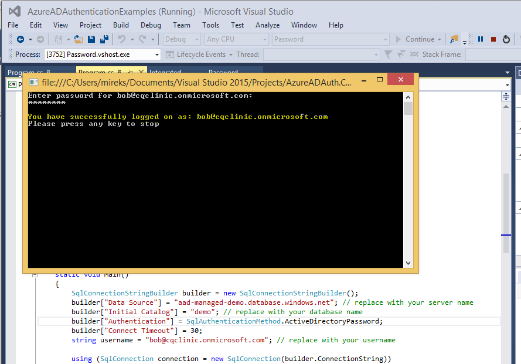

## Run this sample

**Before building and running the Password project**:
1.	In Program.cs, locate the following lines of code and replace the server/database name with your server/database name.
```
builder["Data Source"] = "aad-managed-demo.database.windows.net "; // replace 'aad-managed-demo' with your server name
builder["Initial Catalog"] = "demo"; // replace with your database name
```
2.	Locate the following line of code and replace username, with the name of the Azure AD user you want to connect as.
```
string username = "bob@cqclinic.onmicrosoft.com"; // replace with your username
```
Note: A contained user database must exist and a contained database user representing the specified Azure AD user or one of the groups, the specified Azure AD user belongs to, must exist in the database and must have the CONNECT permission (except for AAD server admin or group)

Please note that
builder["Authentication"] method is set to SqlAuthenticationMethod.ActiveDirectoryPassword.


When running this program an execution window a prompt for the Azure AD password request for user bob@cqclinic.onmicrosoft.com will appear. Once the password is entered the message should indicate a successful connection to the database followed by “Please press any key to stop”:


